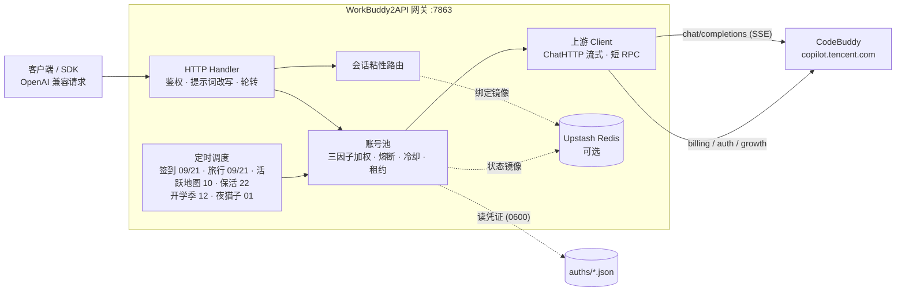

<p align="center">
  
</p>

> WorkBuddy CN（CodeBuddy / copilot.tencent.com）的 OpenAI 兼容反向代理，支持 OAuth 登录、多账号轮转、工具调用与流式响应。可选集成智谱 AutoClaw（澳龙）云端账号体系作为第二上游。
<h1 align="center">WorkBuddy2API</h1>

<p align="center">
  <b>把 CodeBuddy 账号变成 OpenAI 兼容 API 的多账号网关</b><br>
  OAuth 登录 · 账号池轮转 · 熔断与冷却 · 会话粘性 · 积分补充
</p>

- 🔐 **OAuth 登录** — 通过 `/v2/plugin/auth/state` 设备授权流程获取凭证，支持 token 自动刷新
- 🔄 **多账号轮转** — 三因子加权随机选号（credits ×闲置×成功率），防热点 + 防惊群（100ms 窗口）
- 🛠 **工具调用** — 完整支持 OpenAI tools/tool_choice，流式 `tool_calls` 按 index 合并
- 📡 **流式 + 非流式** — 上游 SSE 透传；非流式本地聚合（上游拒绝非流式请求）
- ⏰ **定时签到** — 每日 09:00 / 21:00 自动签到 + 积分查询，积分耗尽账号次日 04:00 自动恢复
- 🦞 **AutoClaw 上游（可选）** — `autoclaw/*` 模型前缀路由到智谱 AutoClaw 云端；手机验证码登录、独立 token 刷新（轮换写回）、每日签到（400 分/次，幂等）、积分钱包查询
- 📊 **积分监控** — `credit.sh` 一键查询全部账号剩余/总量/百分比
- 🔑 **登录工具** — `login.sh` 交互式登录，落盘即生效
- 🏗 **Docker 部署** — 一键 `docker compose up`，healthcheck 常驻
- 📈 **请求级日志** — 每个 `/v1/chat/completions` 请求打表格日志（seq/TTFB/uid/tokens/latency）
- 🏥 **健康检查** — `/healthz` 无健康账号时返回 503，可接负载均衡器
- 📉 **状态汇总** — `/status` 返回 total/healthy/cooling/disabled 计数 + 每账号完整画像
<p align="center">
  
  
  
  
  <a href="https://t.me/sliverkiss_blog"></a>
</p>

---

## 项目简介

WorkBuddy2API 是一个自托管的 **OpenAI 兼容上游网关**，将 ```CodeBuddy``` 账号包装为统一的 `/v1/chat/completions` 服务。

### 本项目做什么

- 通过 **OAuth 设备授权**（`login.sh`）获取账号凭证，在网关侧做 token 自动刷新、账号池调度与流量治理；
- 面向 **个人多账号** 场景：多账号共享、单号故障自动换号、冷却 / 熔断防止雪崩、会话粘性保证多轮上下文不跳号；
- 对客户端只暴露 OpenAI 兼容接口，现有 SDK / 前端 / 工具 **零改造接入**。

### 本项目不做什么

- **只做上游网关，不做下游协议转换** — 本项目仅负责对接上游 ```CodeBuddy``` 并暴露 OpenAI Chat 协议；Anthropic Messages、Gemini 等其他协议的适配应由下游网关负责；
- **不内嵌 Web 管理面板** — 网关核心保持精简，可视化面板作为独立项目维护，数据直取上游接口，不增加网关适配负担。

### 社区前端面板

需要 Web 管理面板的用户，可部署以下符合本理念的社区项目（独立维护，与网关解耦）：

- [workbuddy2api-gui](https://github.com/287775856/workbuddy2api-gui) — 账号池状态可视化面板
- [workbuddy-manager](https://github.com/ithtelab/workbuddy-manager) — 账号管理工具

> ⚠️ 合规须知：本项目是**非官方**网关，使用 ```CodeBuddy``` 账号作为上游，**仅限本人授权账号、本机 / 私有环境测试**。详细边界见[安全与合规](#安全与合规)。

📖 完整文档见 [GitHub Wiki](https://github.com/Sliverkiss/workbuddy2api/wiki)。

## 核心能力

### 账号池治理

- **OAuth 设备授权登录** — `login.sh` 一条命令完成：取授权 URL → 浏览器登录 → token 轮询 → 凭证落盘 → 重启加载，全程无 PKCE（state 由服务端签发），重复执行即可连续添加多账号
- **三因子加权随机选号** — `credits 比例 ×10 + 快过期积分占比 ×8 + 闲置补偿` 三项加权（`pool.expiring_soon` 窗口内的积分优先消耗，默认 7 天），按权重降序取 **Top-5 候选短名单**，再在短名单内加权抽签（等权重候选先随机打乱防惊群、LRU 兜底覆盖全部候选），兼顾积分多、快过期积分先用掉、闲置久的账号；失败账号由熔断 / 冷却 / 连败降权状态机处置（不进权重公式）
- **防惊群** — 跳过 100ms 内刚被选中的账号，多账号同时待命时不打爆同一台
- **在途租约** — 单账号最大在途请求数（`pool.max_in_flight`）限制并发占用，占满的号不参与选号，避免单号过载
- **账本择优** — 每次成功请求按 `usage.credit` 折算每千 token 单价记入 `(账号, 模型)` 账本，免费 / 便宜的账号优先；观测按 EMA 平滑、6 小时未更新即失效（陈旧价格不复活），成本随上游活动实时变化；账本随池状态落盘 `state.json`，重启不丢学费；`/status` 透出 `model_costs` 台账（模型 / 单价 / 末次观测 / 样本数）
- **成本分层条件探索** — costTier 硬过滤（免费 > 未知 > 收费）会把全池锁死在唯一的实测免费号上：其余账号永远轮不到、也就永远学不到「它其实也免费」（垄断 + 学习冻结，issue #136）。破解方式是**搭车改道**：tier 0 垄断层存在且 tier 1 有成员时，距上次探索 ≥ `pool.cost_explore_interval`（默认 30m，`"0"` 关停）就把本次选号改道给一个未知号——承接的是完整真实用户请求，**零新增上游请求**（IP 维度零增量，WAF 友好）。成功即毕业（首观测入账，免费回 tier 0 / 收费出局 tier 2，学费只付一次）；失败走既有冷却 / 熔断策略，无探测风暴。探索频率硬性限幅 ≤ 48 次 / 天 / 模型（24h ÷ 30m），与池规模和 QPS 无关；tier 1 枯竭后自动停探。探索节奏按 `(域, 模型)` 独立；`/status` 透出 `cost_explore` 台账（累计事件数 + 各 (域, 模型) 最近探索时刻），与 `model_costs` 行对照即可读出「探索 → 毕业」全链路

### 流量治理

- **分级熔断与冷却** — 429 软冷却（600s 起指数退避、封顶 `soft_rate_max`）、404 固定浅冷却、402 / 余额耗尽硬冷却至次日 04:00、连续失败熔断（`breaker_threshold` 触发后指数退避封顶 6h）
- **模型级限流独立冷却** — 6004（该模型使用量超限）只冷却触发调用的模型，切其他模型立即可用；`/status` 透出 `rate_limited_models` 台账
- **账号临时停用 / 恢复** — 运维可把某个号临时摘出选号池、观察后再放回，不必删凭证（issue #138/#118）。语义是「对话流量摘除」而非「账号冻结」：停用期间签到、token 保活、排程任务照常执行，账号仍在池里、状态照常透出。与系统自动禁用是**两个独立状态位**（`manual_disabled` / `disabled`），各自清除、都清空才回到选号池——避免运维意图被签到解冻等自动复活路径意外解除；停用状态随池状态落盘，重启保留。入口：`/admin/accounts/{uid}/{disable,enable,revive}` 端点 + `cmd/acct` CLI（默认关闭，`admin.enabled` 显式开启）
- **状态持久化** — 池状态（积分 / 冷却 / 熔断 / 计数）本地原子落盘 `state.json`，可选镜像至 Upstash Redis，重启后择优恢复

### 请求链路

- **流式 + 非流式** — 出站强制 `stream:true`；SSE 帧按 OpenAI 规范白名单重建；非流式由本地聚合为单响应
- **DeepSeek 思维链注入** — 出站请求体注入 `thinking.type=enabled` + 默认档位，`reasoning_content` 多轮回填，`reasoning_effort` 按模型档位自动降级
- **系统提示词三模式**（`prompt.mode`，缺省 `passthrough`） —
  - `passthrough`（缺省）：透传客户端原始 system，遇内容拦截自动降级中性提示词重试
  - `custom`：网关用自有提示词**替换**客户端 system/developer（从源头消除模板句误报；不参与降级）
  - `append`：**两者并用**——开头连续 system/developer 块之后插入网关自有提示词，客户端项目规范/工具约定与网关人格共存（issue #129）；降级期与拦截首遇重试时退化为 `custom` 语义（换中性提示词，原文 system 移除）
  - `prompt.file`（custom/append 生效）指向自定义提示词文件，空 = 内置默认
- **会话头族注入** — 出站携带官方客户端会话头族（`X-Conversation-Request-ID` 聚合主键 · `X-Conversation-ID` 透传 · B3 链路），轮转 / 重试 / 路径回退复用同键，后台按对话轮聚合不再碎片化（issue #35）
- **指纹脱敏** — 出站请求体黑名单指纹字段清洗（可开关），与提示词体系两层叠加

### 选号语义

选号 = 会话粘性（命中即定）→ 成本分层（硬过滤）→ 加权随机（软均衡）三层串联，各层语义：

- **成本分层** — 账本把每个 `(账号, 模型)` 归入三档：**tier 0**（实测免费，单价 ≤ 0）、**tier 1**（无观测）、**tier 2**（实测收费）。同一次选号在**存活的最便宜档内**选：有 tier 0 就只在 tier 0 里挑，全池无免费观测才落到 tier 1，再不行才是 tier 2——即「贵号永远只作兜底」。tier 1 的号**不会被跳过**：新账号 / 新模型没跑过就没有观测，直接淘汰会把新号饿死。观测随 `usage.credit` 实时更新且 6 小时过期，所以限免窗口（如夜间免费）一结束，账号回到 tier 1 / tier 2，选号自动跟随——无需重启，日志会打 `free tier ended` 提示价格切换
- **会话粘性** — 同一对话固定走同一账号（多轮上下文不跳号、上游 prompt cache 不碎）。粘性键按此优先级取：**conversation 维度四键**（`metadata.conversation_id` / `metadata.conversationId` / `conversation_id` / `conversationId` 任一）→ **`prompt_cache_key`**（pi-ai 系客户端把会话 ID 放在这个 OpenAI 前缀缓存字段里）→ **首条 user 消息文本的 sha256 兜底**（OpenAI 兼容协议无会话 ID 字段，dsh / Codex 等客户端四键全缺，此前粘性恒不命中、逐请求换号；现由首条 user 消息派生会话级稳定键——会话内历史追加不影响该键，开新会话自然换键）。`user_id` **不是**粘性键——它会把一个用户的所有并行对话钉到同一个号上（粒度远粗于上游对话级缓存边界），发 `user_id` 的客户端回落加权轮换（**该回落同样适用于首条 user 消息兜底**：请求体带 `metadata.user_id` 或顶层 `user_id` 时不派生兜底键）。绑定 30 分钟滚动续期，空闲即过期释放
- **负载分布** — 粘性与分层都未限定时，三因子加权随机（`credits ×10 + 快过期积分 ×8 + 闲置补偿`）把流量摊开：高余额号多扛、快过期积分的号先用、闲置号补位；防惊群跳过 100ms 内刚选中的号。权重是**概率倾斜**而非硬排序（Top-5 短名单 + 名单内抽签），不会让单一账号垄断流量

### 定时积分任务

- **签到**（09 / 21 点）— 每日签到 + 余额查询，余额恢复自动解冻冷却账号
- **活跃地图**（10 点）— 对话事件连发上报点亮活跃地图与连登天数、解锁领养前置，补签卡保连登、连登档位兑换 + 抽奖、礼包/补偿领取，回读 streak 自检
- **猫猫旅行**（09 / 21 点）— 独立排程：领养 / 派出 / 领奖闭环推进
- **token 保活**（22 点）— 全账号刷新 token，session 失效连续 3 次才禁用
- **开学季任务**（12 点）— 任务点亮 + claim + 自动抽空抽奖余额，活动下线时自动跳过
- **夜猫子任务**（01 点）— 夜猫窗口（23:00–08:00 CST）内补一次 black_cat 任务

六类任务独立排程、独立开关（`schedule.*_enabled`），互不影响。

### 双域适配

- 同时适配**国内版（CN，`copilot.tencent.com` / `www.codebuddy.cn`）与国际版（Global，`www.workbuddy.ai`）**账号
- 共享同一账号池，由账号 `realm` 或请求模型名前缀（`cn:` / `global:`）决定路由；`global.enabled` 可一键锁死纯 CN 部署
- 国际版支持注册激活、地区完善、一次性 trial 加油包领取（`./trial.sh`）

### 辅助工具

- 积分日报：`./credit.sh`（美化 / `-json`，realm 感知双域）
- 手动签到：`./signin.sh`（批量、幂等不重复计）
- 账号停用 / 恢复：`./acct.sh list | disable <uid> [原因] | enable <uid> | revive <uid>`（需 `admin.enabled`，走网关管理端点）
- 领养联动 / 任务查询：`scripts/task_runner.py`（成长任务一体机，默认 dry-run）
- 个性化提示词：`prompt.file` 指向自定义提示词文件即整体替换内置默认（`custom`/`append` 模式生效）

## 架构总览



上游请求在出站前经历统一的改写管线（`internal/upstream/payload.go`）：强制 `stream:true`、`developer` 角色归一、tool_choice 归一、`image_url` 字符串兼容为 OpenAI 对象形态、DeepSeek 思维链注入、`reasoning_effort` 档位降级、`reasoning_content` 回填、指纹脱敏。

## 快速开始

### 环境要求

- **Docker + Docker Compose**（推荐部署方式，镜像内已含 `app` 低权限用户与全部工具脚本）
- 一个或多个已注册的 CodeBuddy 账号，用于 OAuth 登录
- 宿主机 Go ≥ 1.22（仅源码构建时需要）

### Docker Compose 一键部署

```bash
git clone https://github.com/Sliverkiss/workbuddy2api.git
cd workbuddy2api
cp config.example.json config.json
# 编辑 config.json，把 api_key 换成自己生成的长随机串（示例里的占位值会被拒绝启动）
#   openssl rand -hex 32
```

编辑 `config.json`，**至少设置 `api_key`**（`留空 = 不鉴权`，公网部署务必设置）。示例中的 `test_key` 等均为占位符，`config.example.json` 不含任何真实密钥。

```bash
# 登录添加账号（重复执行可加多号；注意：执行过下方说明中的 chown 后，
# host 侧 login.sh 会被可写性预检拦截——此时请在容器内登录，见下方说明）
./login.sh
# 打开浏览器登录 → 脚本自动等待并落盘 auths/ → 自动重启服务加载新账号
```

> ⚠️ **账号目录不做运行期热加载**：`LoadDir` + `SyncToDir` 只在进程启动时各执行一次，所以**新增账号后必须重启服务**才生效。
> `login.sh` 已自动处理这一步（依次尝试 docker 容器 → launchd 服务）；手动重启用 `./service.sh restart`。

### 3. 启动服务

# 启动服务
docker compose up -d --build

# 健康检查（无可用账号时 503）；service 字段用于确认打到的是本网关
curl -s http://localhost:7863/healthz
# {"healthy":2,"total":3,"service":"workbuddy2api"}
```

`login.sh` 内置授权 URL 获取 + 浏览器登录 + token 轮询 + 首次签到 + `auths/workbuddy-<uid>.json` 落盘 + 容器重启，全程无 PKCE（state 由服务端签发）。账号池在容器启动时用 `auths/` 目录自动对齐，新增凭证文件即自动发现。

> **非 root 宿主用户注意**：`./login.sh` 以**当前宿主用户**落盘凭证（权限 0600），而容器内网关以 `app(uid 10001)` 读 + 回写（refresh / realm 补标识走 tmp+rename，需要目录写权限）。二者 uid 不同（例如 Linux 非 root 账号通常是 uid 1000）时容器读不到凭证文件，`/status` 账号数为 0——与 `./data` 卷的属主问题同源。登录后、启动前把目录属主交给 10001（root 或部署用户执行）：
>
> ```bash
> chown -R 10001:10001 ./auths
> ```
>
> 之后新增账号**必须**进**容器内**登录（`app` 自身落盘，属主即 10001，无需反复 chown；chown 后 host 侧 `./login.sh` 无写权限，脚本会在启动浏览器授权前直接退出并提示，不会白走一遍 OAuth。容器内无 docker CLI，完成后回宿主机重启）：
>
> ```bash
> docker compose exec -it wb2api bash -c './login.sh' && docker compose restart wb2api
> ```

### 源码构建

```bash
go build ./...
go vet ./...
go test ./...      # 完整测试套件
go run ./cmd/server -config config.json
```

构建二进制：

```bash
CGO_ENABLED=0 go build -trimpath -ldflags="-s -w" -o wb2api ./cmd/server
CGO_ENABLED=0 go build -trimpath -ldflags="-s -w" -o signin_bin ./cmd/signin
CGO_ENABLED=0 go build -trimpath -ldflags="-s -w" -o login ./cmd/login
CGO_ENABLED=0 go build -trimpath -ldflags="-s -w" -o credit ./cmd/credit
```

#### Windows 原生运行（无需 Docker）

Windows 10/11 自带的 PowerShell 与 `curl.exe` 即可管理后台进程。先准备配置并构建：

```powershell
Copy-Item config.example.json config.json
# 编辑 config.json；建议把 listen 设为 127.0.0.1:7863，且务必设置 api_key

go build -trimpath -ldflags="-s -w" -o wb2api.exe ./cmd/server
go build -trimpath -ldflags="-s -w" -o login.exe ./cmd/login
go build -trimpath -ldflags="-s -w" -o signin_bin.exe ./cmd/signin
go build -trimpath -ldflags="-s -w" -o credit.exe ./cmd/credit
```

使用仓库自带脚本在后台启停并查看状态：

```powershell
.\start-workbuddy2api.cmd
.\status-workbuddy2api.cmd
.\stop-workbuddy2api.cmd
```

PID 写入 `wb2api.pid`，标准输出与错误日志分别写入 `data/server.out.log`、
`data/server.err.log`。停止脚本会先验证 PID 对应的可执行文件确为当前目录下的
`wb2api.exe`，不会因陈旧 PID 误杀其他进程。

添加账号可使用配套管理面板，或在 Git Bash 中运行现有 `login.sh`（它还负责 CN
首次签到以及 Global 注册地区/trial 流程；不建议只手工调用 `login.exe` 后跳过这些步骤）。

### 验证

```bash
# 模型列表
curl -s http://localhost:7863/v1/models -H "Authorization: Bearer your-api-key"

# 账号状态（汇总 + 每账号详情，含 disabled / manual_disabled 双位）
curl -s http://localhost:7863/status -H "Authorization: Bearer your-api-key"

# 临时停用一个账号（需 config 里 admin.enabled = true）
curl -s -X POST http://localhost:7863/admin/accounts/<uid>/disable \
  -H "Authorization: Bearer your-api-key" -H "Content-Type: application/json" \
  -d '{"reason":"观察几天"}'
# 或用 CLI（自动从 config.json 读网关地址与 key）
./acct.sh list && ./acct.sh disable <uid> 观察几天 && ./acct.sh enable <uid>

# 流式聊天
curl -sN http://localhost:7863/v1/chat/completions \
  -H "Authorization: Bearer your-api-key" \
  -H "Content-Type: application/json" \
  -d '{"model":"deepseek-v4-flash","messages":[{"role":"user","content":"hi"}],"stream":true}'

# 非流式聊天（本地聚合）
curl -s http://localhost:7863/v1/chat/completions \
  -H "Authorization: Bearer your-api-key" \
  -H "Content-Type: application/json" \
  -d '{"model":"deepseek-v4-flash","messages":[{"role":"user","content":"hi"}],"stream":false}'
```

## 只在本机跑（不用 Docker）

本机自用推荐直接绑回环 —— 此时**不需要设置 `api_key`**（仅本机可达，安全闸门只告警不拦）：

```bash
# 零配置：不需要 config.json，也不需要先建 auths/（先跑起来再加账号）
WB2A_LISTEN=127.0.0.1:7863 go run ./cmd/server
```

若要保持默认的 `:7863`（全网卡）监听，则**必须**给一个真 key：

```bash
cp config.example.json config.json
python3 -c "import json,secrets;p='config.json';d=json.load(open(p));d['api_key']=secrets.token_hex(32);json.dump(d,open(p,'w'),indent=2);print('api_key 已写入 config.json')"
go run ./cmd/server
# 之后所有请求都要带 -H "Authorization: Bearer <config.json 里的 api_key>"
```

> ⚠️ **Docker 场景下不要把容器内 `listen` 改成 `127.0.0.1`**：端口映射是从宿主机打到容器 IP，绑容器回环会让 `7863:7863` 映射不通。
> 要收紧暴露面请改 compose 的宿主机侧 —— `"127.0.0.1:7863:7863"`。

### 开机自启（macOS launchd）

```bash
./service.sh install     # 生成 plist → 加载 → 开机自启（幂等，可反复执行）
./service.sh status      # 服务状态 + 端口探测
./service.sh restart     # 重启（登录新账号后加载凭证用）
./service.sh logs        # 跟踪日志
./service.sh uninstall   # 停止并关闭开机自启
```

- plist 写入 `~/Library/LaunchAgents/com.hubo.workbuddy2api.plist`，其中路径按仓库实际位置生成，可整目录搬迁后重跑 `install`。
- `RunAtLoad` + `KeepAlive`：登录即启动、崩溃自动拉起；`ThrottleInterval=10` 避免配置错误时打爆日志。
- 环境变量写死 `WB2A_LISTEN=127.0.0.1:7863` —— **即使 `config.json` 里写了 `:7863`，也会被 env 覆盖回回环**，不会因改配置意外暴露到全网卡。
- 日志落在 `logs/wb2api.{out,err}.log`（已 gitignore）。

> 本机自用走"回环 + 不设 key"，所以 `install` 不需要任何密钥。若你的终端被本工具之外的环境限制（无法写 launchd 域），`install` 会明确提示手动执行的那一条命令；plist 本身放在 `~/Library/LaunchAgents/` 下，**下一次登录也会自动加载**。

### 登录账号

服务启动后 `auths/` 是空的（0 账号，`/healthz` 会返回 503），需要登录至少一个账号：

> ⚠️ **务必用 `./login.sh`，不要直接跑 `./login url`。** `url` 只是「取授权链接」的底层子命令 ——
> 它不轮询、不落盘，打印完链接就结束；而且每次都会覆盖 `/tmp/wb2api-login-state.json`，
> 让**上一个链接立即失效**。单独跑它 = 「浏览器里登录了，但什么都没保存」。

```bash
cd /Users/hubo/Tools/workbuddy2api
./login.sh
```

1. 脚本打印授权 URL（**并自动复制到剪贴板**）。在浏览器打开该链接，登录你的 **WorkBuddy CN / CodeBuddy CN 账号**，并在**授权页点确认**（`copilot.tencent.com` 设备授权流程，无 PKCE）。
2. **不需要按任何键**：脚本会自动轮询等你完成登录（默认最长 5 分钟，可用 `LOGIN_POLL_TIMEOUT=<秒>` 调整）。
3. 登录完成后脚本自动继续：**先把凭证落盘** `auths/workbuddy-<uid>.json`（先保住 token，再做其余步骤）→ 上游每日签到（幂等，失败不阻塞）→ 重启服务加载新账号 → 打印当前账号数。

**多账号（关键）**：每次登录前必须让浏览器处于**目标账号**的登录态 —— 先退出当前账号，或用**无痕窗口**打开新链接。
否则浏览器会复用当前登录态、**重复授权同一个账号**（uid 相同 → 覆盖同一份 auth 文件），跑几次都还是同一个账号。

> ⚠️ 账号目录只在**进程启动时**扫描一次（`auth.LoadDir` + `pool.SyncToDir`），运行期不热加载 —— 所以手工新增或替换 auth 文件后必须 `./service.sh restart`。
> ⚠️ **state 是一次性的，且每次 `login url` 都会签发新 state、让旧的立即失效**（state 落在 `/tmp/wb2api-login-state.json`，同一时刻只能有一个登录流程）。所以重跑 `./login.sh` 后**必须打开最新打印的那条链接** —— 你若用旧链接完成授权，脚本等待的却是新 state，会一直等不到而超时。
> ⚠️ 登录在浏览器侧完成，**授权页需要点确认**；仅"浏览器里已登录"并不等于授权完成。

## AutoClaw 上游（可选）

第二上游：智谱 [AutoClaw（澳龙）](https://autoglm.zhipuai.cn/autoclaw) 云端账号体系。`model` 以 `autoclaw/` 前缀路由到该上游，其余模型继续走 WorkBuddy 池，两者互不影响。

### 启用步骤

```bash
# 1. 编译登录工具
export PATH="/opt/homebrew/bin:$PATH"
go build -o wb2api-autoclaw-login ./cmd/autoclaw-login

# 2. 手机验证码登录（两步）
./wb2api-autoclaw-login -phone 138xxxxxxxx          # 发送验证码
./wb2api-autoclaw-login -phone 138xxxxxxxx -code 123456   # 登录 → 落盘 auths/autoclaw-<uid>.json

# 3. 配置启用（config.json 或 env）
#   config.json: { "autoclaw": { "enabled": true } }
#   或 env:      WB2A_AUTOCLAW_ENABLED=1
./service.sh restart   # auth 目录启动时扫描一次，必须重启

# 4. 使用
curl http://127.0.0.1:7863/v1/chat/completions \
  -H 'Content-Type: application/json' \
  -d '{"model":"autoclaw/zai_auto","messages":[{"role":"user","content":"hi"}]}'
```

### 模型列表（实测可用）

| 模型 | 说明 |
|---|---|
| `autoclaw/zai_auto` | 官方自动路由（推荐默认） |
| `autoclaw/zai_auto-fast` | 自动路由-快速档 |
| `autoclaw/zai_glm-5.3-flash` | GLM-5.3-Flash（1M 上下文） |
| `autoclaw/zai_glm-5-turbo` | GLM-5-Turbo |
| `autoclaw/zaicoding_glm-5.3` | GLM-5.3（Coding Plan） |
| `autoclaw/tdpsk_deepseek-v4-flash-202605` | DeepSeek-V4.1-Flash |
| `autoclaw/tdpsk_deepseek-v4-pro-202606` | DeepSeek-V4-Pro |

> 注：`tdpsk_deepseek-v4-flash-202605` 是**路由 ID**（即请求头 `X-Request-Model` 的值），AutoClaw 客户端界面把它显示为
> **Deepseek-V4.1-Flash** —— ID 里不含小版本号，别把它误读成 4.0。

### 行为说明

- **token 自管**：服务独立持有 refresh token（`/userapi/v1/refresh`，轮换写回凭据文件），临期自动刷新；与 WorkBuddy 上游同语义。
- **每日签到**：调度器 09/21 点对 autoclaw 账号执行 `daily_signin`（幂等，400 分/次），并刷新积分余额进 `/status`。
- **账号独占**：⚠️ 同一手机号**不要**同时在 AutoClaw 桌面端登录 —— 双方各自轮换 refresh token 会互踢，表现为其中一方频繁 401。
- **错误处理**：401 → 自动刷新重试一次，仍失败标记 `needs_relogin`（`/status` 可见，需重新运行登录命令）；429 → 60s 软冷却；积分不足 → 冷却到次日 04:00；非法模型 → 400 原样透传。
- **协议来源**：AutoClaw.app 1.18.1 客户端逆向 + 实测（详见 `docs/specs/2026-09-11-autoclaw-provider.md`）。**非官方 API**，客户端版本升级可能导致协议漂移（签名/端点/模型白名单变化），届时需更新 `internal/autoclaw` 的常量。

## Qoder 上游（可选）

第三上游：阿里 [Qoder](https://qoder.com)（AI IDE）的 **CN（qoder.cn）与国际版（qoder.com）双域**账号。
`model` 以 `qoder/<realm>/<key>` 形式路由（realm 为 `cn`/`global`），与 WorkBuddy/AutoClaw 池互不影响。
协议直连实现移植自 9router（github.com/decolua/9router，MIT）：COSY 混合签名（RSA+AES+MD5，17 个 Cosy-* 头）、
WAF-bypass body 编码、`{statusCodeValue, body}` SSE 信封解包，全部在网关侧完成——外部调用方只看到标准 OpenAI 协议。

### 启用步骤

```bash
# 1. 编译登录工具
go build -o wb2api-qoder-login ./cmd/qoder-login

# 2a. 设备流登录（浏览器授权；token 约 30 天）
./wb2api-qoder-login device --realm=global        # 国际版 qoder.com
./wb2api-qoder-login device --realm=cn            # 国内版 qoder.cn（独立账号体系）

# 2b. 或 PAT 导入（qoder.com / qoder.cn → Account → Integrations，pt- 前缀）
./wb2api-qoder-login pat --realm=global --token=pt-xxxx

# 3. 配置启用（config.json）
#   { "qoder": { "enabled": true } }
./service.sh restart

# 4. 使用（Authorization 带登录落盘的 access token，网关按 token 查池签名）
curl http://127.0.0.1:7863/v1/qoder/global/chat/completions \
  -H 'Content-Type: application/json' \
  -H 'Authorization: Bearer dt-xxxx' \
  -d '{"model":"qoder/global/auto","messages":[{"role":"user","content":"hi"}],"stream":true}'
```

### 模型列表

| 模型 | 说明 |
|---|---|
| `auto` / `ultimate` / `performance` / `efficient` / `lite` | 档位路由 |
| `qmodel_38max` / `qmodel_latest` / `qmodel` / `qfmodel` | Qwen 系列 |
| `kmodel_latest` / `kmodel` | Kimi 系列 |
| `gmodel` / `gfmodel` | GLM 系列 |
| `dmodel` / `dfmodel` | DeepSeek 系列 |
| `mmodel` | MiniMax |

### 行为说明

- **双域分池**：CN 与国际版是独立部署（服务器/账号体系均不同），登录与账号池按 realm 隔离，聊天路由 `/v1/qoder/{realm}/chat/completions` 按路径分流。
- **token 不可刷新**：设备流 token 约 30 天有效，上游 refresh 端点对设备流实测 403（9router 同口径）——过期后重新登录即可；PAT 导入的 job token（jt-）约 24h，由网关按需重换。
- **jt- 走备用域**：国际版推理域 api3.qoder.sh 拒绝 jt- token（"Login expired"），网关自动切 api2.qoder.sh；dt- 设备 token 固定走 api3。
- **model_config 必须先拉目录**：`model_config` 发错上游会**静默降级到别的模型**，网关按账号 COSY 签名拉取 `/algo/api/v2/model/list`（缓存 1h），缺失即硬报错不猜测。
- **CN 端点（qoderclicn 1.1.58 二进制提取核实）**：登录/轮询走 `openapi.qoder.com.cn`（登录 URL 另带 `client_id`），推理走 `gateway.qoder.com.cn/model/v1/chat/completions`——标准 OpenAI 形态、bearer 鉴权、无 COSY/Encode。注意：gateway 域对无认证流量返回 ALB 503，需真实账号 token 实测确认；域名可用 `QODER_CN_OPENAPI_BASE` / `QODER_CN_CHAT_BASE` / `QODER_CN_LOGIN_PAGE` 覆盖。
- **协议来源**：9router open-sse/shared/qoder/*（其源自 CLIProxyAPIPlus qoder-provider 分支并与 live qodercli 流量核对）+ qoder-shim 对 CN 官方 API 的实测记录。**非官方 API**，客户端版本升级可能导致协议漂移（RSA 公钥/签名头/端点变化），届时需更新 `internal/qoder` 的常量。

> 想把 Qoder 接进 Codex CLI / Claude Code，或在 opencodex 面板里直接登录管理：先
> `./integrations/opencodex/apply_qoder.sh` 打补丁并 `ocx restart`，面板即出现
> `qoder-global` 与 `qoder-cn-oauth` 两个 OAuth provider（opencodex 上游另有内置
> `qoder`/`qoder-cn` 为官方 CLI 包装型 key provider，与我们互不冲突）。登录与对话均经网关 7863 代理。

> 想把 `autoclaw/*` 模型接进 Codex CLI / Claude Code，或在 opencodex 面板里直接管理 AutoClaw 账号池，
> 见下文「接入 opencodex」中的 **把 workbuddy / autoclaw 内置进 opencodex** 一节。

## 配置说明
## 安全与合规

### 发布来源与合规边界

- **CI 自动打包**：GitHub Actions（`.github/workflows/build.yml`）每日定时 + push tag 触发多架构（amd64/arm64）构建，发布至 `ghcr.io`，同时输出 amd64 离线 `tar.gz` artifact 供 NAS / 离线环境使用；也可本地 `docker compose build` 自构建
- 登录 / 签到 / 积分工具：`./login.sh` / `./signin.sh` / `./credit.sh`
- **无产物校验和**：`go.sum` 仅约束 Go 模块依赖；Docker 镜像由本地 `docker compose build` 生成，未引用第三方镜像
- 上游 CodeBuddy 属第三方商业产品，本项目是其**非官方 OpenAI 兼容网关**；使用其账号做 API 网关涉及目标平台服务条款与账号风险，作者不对账号封禁、条款违约或使用结果负责

### 授权使用边界

## 安全

### 启动闸门（fail closed）

`api_key` 为空等价于**完全不做鉴权**：任何网络可达者都能调 `/v1/chat/completions` 烧账号积分，或读 `/status` 拿到全部账号的 uid / 昵称 / 积分 / 错误原因。因此启动时有一道硬闸门（`Config.ValidateForServe`）：

| 监听地址 | `api_key` | 行为 |
|---|---|---|
| 非回环（`:7863` / `0.0.0.0` / 实际网卡 IP） | 空或示例占位值 | **拒绝启动**（`log.Fatalf`） |
| 非回环 | 已设置 | 正常启动 |
| 回环（`127.0.0.1` / `::1` / `localhost`） | 空或示例占位值 | 打醒目 WARN 后启动（本机自用合理） |

- "示例占位值"指 `your-api-key-here` / `your-api-key` / `changeme` 等文档样例值——`cp config.example.json config.json` 后忘记改也会被拦下，不会带着众所周知的 key 裸跑。
- 确需在非回环地址无鉴权运行（例如前面已经挂了自带鉴权的反向代理）时，必须**显式**设置 `WB2A_ALLOW_INSECURE_LISTEN=1`，闸门才降级为 WARN。

### API key 校验

- 常量时间比较：用 `crypto/subtle.ConstantTimeCompare` 比较 key 的 **SHA-256 摘要**，避免 `!=` 原文比较带来的逐字节时序侧信道；摘要定长，长度维度同样不泄露。
- `login.sh` 查询账号数用的 key，按 **`API_KEY` 环境变量 → `config.json` 的 `api_key`** 顺序获取，**无内置默认值**——密钥不进入版本库，也不会拿一个写死的值去猜。

### 凭据与历史（运维待办）

- `config.json` / `auths/` / `data/` 已由 `.gitignore` 排除，请勿入库。
- 若曾把真实 key 提交过，**轮换该 key 是必须的**；清理历史需 `git filter-repo` 改写并强推，须协调所有 clone。轮换 + 清理一起做才算完整闭环。
- 建议：`config.json` 权限 `chmod 600`；对外只暴露反向代理，端口（docker-compose 的 `7863:7863`）如需公网访问，优先改为 `127.0.0.1:7863:7863`。

## 账号轮换与冷却策略

### 状态机

```
Healthy → Cooling → (签到恢复) → Healthy
   ↓           ↑
Disabled ←────┘ (session 死亡，永久)
```

### 错误分类

| 错误类型 | 冷却策略 | 恢复方式 |
|---|---|---|
| **402 + 余额关键词** | 冷却到**次日 04:00** | 签到任务（09:00/21:00）自动恢复 |
| **429 限流** | 60s 短冷却 | 到期自动恢复 |
| **401 + session 死亡** | **永久禁用** | 人工重新登录 |
| **404 上游偶发** | 60s 短冷却（不累计错误计数） | 到期自动恢复 |
| **5xx 上游故障** | 喂熔断计数（`pool.breaker_threshold` 触发指数退避熔断） | 熔断到期自动恢复 / 成功清零 |
| **网络抖动** | **不计失败**，立即换号重试 | 即时 |

### 挑选策略

1. **状态过滤**：Disabled / Cooling / 熔断 / 在途占满 不选
2. **Top-5 候选**：按三因子权重降序取前 5（credits 只是权重的一个因子，闲置补偿与成功率同样决定谁进短名单）
3. **三因子加权随机**：权重 = credits 比例 ×10 + 闲置补偿 + 成功率 ×3（credits 全 0 仍按闲置+成功率加权）
4. **防惊群**：跳过 100ms 内刚被选中的账号（除非 top5 全部刚被用过，退回 LRU）

## 账号池 v3

在 v2 基础上吸收外部项目成熟设计，引入四块能力：

- **熔断器（指数退避）**：连续 `pool.breaker_threshold` 次失败熔断，退避 `breaker_cooldown × 2^retryCount` 封顶 `breaker_cooldown_max`；成功清零。单一连续失败计数器 `fails`，签到解冻只清冷却（余额恢复）不动熔断——熔断作为"连续 5xx"信号要到退避到期或下次 chat 成功才恢复。
- **三因子加权选取**：`credits 比例 ×10 + idleWeight + successRate ×3`。闲置补偿每小时 `+idle_weight_per_hour`（封顶 `idle_weight_max`），成功率无记录给中性 1.5。
- **在途租约**：单账号并发上限 `pool.max_in_flight`（0 = 不限），`Pick` 跳过占满账号。
- **会话粘性路由**：同一 `metadata.conversation_id`/`conversation_id`/`metadata.user_id` 尽量绑定同一账号，TTL 滚动续期；请求失败自动解绑回落轮换，请求成功后会话绑定**跟随最终成功号**。
- **全冷却兜底**：无 healthy 账号时从冷却账号选最早到期者顶班（禁用与余额耗尽号永不参与）。

### Redis（Upstash）镜像

- 配置 `upstash.url/token`（空 = 纯内存模式，一切功能照常，只打一条启动警告）。
- Redis 仅做异步镜像（粘性会话映射防重启丢失 + 池状态快照恢复备份），**不在请求热路径同步调用**。
- 池状态快照：每次本地 `state.json` 落盘同步镜像一份到 Redis（带 `saved_at`）；启动时**择新恢复**——Redis 快照比本地新才采用，否则本地优先。
- `/status` 透出 `redis_mode`（`upstash`/`noop`）与池级 `sticky_sessions`。

### 请求级日志

每个 `/v1/chat/completions` 请求结束后打一行表格日志到 stdout：

```
| #001 | 18:31:31 | deepseek-v4 | stream | 200 | uid=0851ce35 | TTFB=801ms | tok=60 | 23.5tok/s | total=2.6s |
```

字段说明：
- `#001`：请求序号（进程级 atomic counter）
- `TTFB`：首 token 到达时间（stream 模式）
- `tok`：输出 token 数（从上游 usage.completion_tokens 精确读取，非估算）
- `uid`：账号 UID 前 8 位

## 工具脚本

| 脚本 | 用途 |
|---|---|
| `./login.sh` | OAuth 登录 → 落盘 auth → 重启服务；key 依次取 `API_KEY` 环境变量 → `config.json` 的 `api_key`，本机回环无鉴权模式下则不带鉴权头直接查 |
| `./service.sh` | macOS 开机自启 / 停止 / 重启 / 状态 / 日志（见上方「开机自启」） |
| `./credit.sh` | 积分日报（美化输出） |
| `./credit.sh -json` | 积分原始 JSON |
| `./signin.sh` | 批量签到（遍历 auths/ 下所有账号） |

## API 端点

除 `/healthz` 外，所有端点都受 `api_key` 保护（配置了 key 就必须带 `Authorization: Bearer <api_key>`）：

| 端点 | 鉴权 | 说明 |
|---|---|---|
| `POST /v1/chat/completions` | Bearer | OpenAI 兼容聊天补全（流式/非流式） |
| `GET /v1/models` | Bearer | 模型列表（动态拉取 + 静态兜底） |
| `GET /status` | Bearer | 账号状态汇总（total/healthy/cooling/disabled + 每账号详情） |
| `GET /healthz` | 无 | 健康检查（无健康账号时 503） |

## 接入 opencodex（Codex CLI / Claude Code 获得 WebUI 与统一入口）

本项目**自身没有 WebUI**，只有上面这 4 个 JSON 端点。若想有界面、或把 WorkBuddy CN 账号的额度接进 Codex CLI / Claude Code / Claude Desktop，可把它作为一个 **OpenAI 兼容 provider** 挂到 [opencodex](https://github.com/lidge-jun/opencodex)（本地代理 + Dashboard，默认 `http://localhost:10100`）。

opencodex 侧用 `openai-chat` 适配器即可，因为它本来就是 Chat Completions：

```bash
ocx provider add workbuddy \
  --adapter openai-chat \
  --base-url http://127.0.0.1:7863/v1 \
  --allow-private-network \
  --default-model hy3
ocx sync        # 触发模型发现（会调 /v1/models，把模型写进 Codex 目录）
```

之后 `codex -m "workbuddy/hy3" "..."` 即可走本项目的账号池。

> ⚠️ **`--allow-private-network` 是必需的**：opencodex 默认对私网/回环目标做 SSRF 拦截，缺了它 provider 能在配置里出现但请求永远失败。

> ⚠️ **若你的环境设了 `http_proxy`/`HTTP_PROXY`，必须同时设置 `NO_PROXY` 含 `127.0.0.1,localhost`**，否则模型发现会失败且**没有任何请求日志**：
> ```
> Provider model discovery for "workbuddy" threw Error [urlClass=provider-models, fallback=configured].
> ```
> 原因是 opencodex 在 `provider-outbound.ts` 里对"走代理 + 私网目标 + NO_PROXY 不匹配"直接抛错（错误类名是裸 `Error`，区别于策略拦截的 `ProviderOutboundPolicyError`）。launchd 方式托管时把 NO_PROXY 写进 plist 的 `EnvironmentVariables`，再重启生效。

验证（`<key>` 取 `~/.opencodex/config.json` 的 `apiKeys[0].key`）：

```bash
curl -s http://127.0.0.1:10100/v1/chat/completions \
  -H "Authorization: Bearer <key>" -H 'Content-Type: application/json' \
  -d '{"model":"workbuddy/hy3","messages":[{"role":"user","content":"hi"}]}'
```

撤销：`ocx provider remove workbuddy`。

### 把 workbuddy / autoclaw 内置进 opencodex（OAuth 账号池）

上面 `ocx provider add` 那条路只能拿到 **API-key 池**（且换号只在 429 时触发）。原因是 opencodex 的 OAuth 账号池 ——
`~/.opencodex/auth.json` 里的 `accounts[]`、额度窗口、后台续期 —— **只对内置 provider 开放**：
要求 provider 在 registry 里带 `authKind: "oauth"`，并有内置的登录/刷新实现。

本仓库用**幂等补丁脚本**（[`integrations/opencodex/`](integrations/opencodex/)）把 `workbuddy` 与 `autoclaw`
变成真正的内置 provider，从而拿到完整的 OAuth 池能力：

| 脚本 | 作用 |
|---|---|
| `apply.sh` | 注入 `workbuddy` 内置 provider（registry 条目 + `OAUTH_PROVIDERS` 注册 + 额度显示） |
| `apply_autoclaw.sh` | 注入 `autoclaw` 内置 provider，含 `authHeaderName: X-Authorization` 适配（AutoClaw 网关只认这个头） |
| `apply_gui.sh` | 注入 AutoClaw 账号管理页（静态页 + `/providers` 浮动入口 + iframe 例外） |

```bash
cd integrations/opencodex
./apply.sh && ./apply_autoclaw.sh && ./apply_gui.sh
ocx restart                  # 账号池不进运行时，必须重启
ocx login workbuddy          # 浏览器授权；要加【另一个】账号就用无痕窗口打开打印的 URL
ocx login autoclaw           # 手机验证码 / Google / Z.ai 三种方式
ocx account list workbuddy   # 查看账号池
```

> ⚠️ **每次 `ocx update` 之后都要重跑这三个脚本。** opencodex 的自更新会整体替换 `src/`，补丁会被抹掉，
> 表现为面板里 provider 消失、`ocx login workbuddy` 提示未知 provider。三个脚本都是**幂等**的，重复跑安全；
> 每个都自带备份，`./apply.sh --revert` / `./apply_autoclaw.sh --revert` 可回滚。

> ⚠️ **`./apply.sh --check` 的冒烟校验别跳过。** 它会真正加载模块并断言 `listOAuthProviders()` 含目标 provider ——
> 「补丁文本在位、但注册没生效」（升级后常见的静默失败）只有这一步能抓到。

内置化之后得到的能力：

- **多账号池 + 自动切换**：复用 opencodex 的 `generic-account-failover.ts`，账号可在面板里直接增删
- **后台 token 续期**：`token-guardian.ts` 定期刷新，无需人工干预
- **AutoClaw 账号管理页**：<http://127.0.0.1:10100/autoclaw-accounts.html>
  —— 手机验证码登录 / Google / Z.ai 网页 OAuth（含阿里云滑块），`/providers` 页右下角也有浮动入口
- **额度显示**：provider 卡片上直接显示 WorkBuddy 积分余额 / AutoClaw 积分

两个必踩的配置点：

| 项 | 必须是 | 否则 |
|---|---|---|
| `autoclaw` 的 `baseUrl` | `http://0.0.0.0:7863/v1/autoclaw` | 写 `127.0.0.1` / `localhost` 会被 opencodex 判成「本地」provider → **账户 tab 根本不渲染**（`0.0.0.0` 同样可达本机端口，且不在它的 loopback 名单里） |
| `autoclaw` 的 `authHeaderName` | `X-Authorization` | AutoClaw 网关不认 `Authorization` → 401 |

> 补丁靠**锚点**定位 opencodex 源码。上游重构会让锚点失配，此时脚本会**显式报错并自动回滚**，不会写坏文件。
> 已知 2.58.0 的漂移点：`OAUTH_PROVIDERS` 之后新增了 `DEPRECATED_OAUTH_PROVIDER_ALIASES` 块、
> `providers/quota.ts` 拆包出 `quota/account-cache.ts` + `quota/report-cache.ts`、
> `adapters/openai-chat.ts` 拆包出 `openai-chat/wire.ts`。脚本已改为**结构化定位**（花括号配对）以适配这类变化。
> 若报「锚点匹配 0 次」，说明上游结构又变了，改锚点即可（脚本会指出是哪个文件）。

### 在 Dashboard 里改过 provider 后「模型全部消失」

在 opencodex Dashboard 编辑过这个 provider 后，若模型列表整块变空（`ocx models live --provider workbuddy` 返回 `[]`、Codex 里也看不到），先查这两项：

| 字段 | 必须是 | 若错了会怎样 |
|---|---|---|
| `adapter` | `openai-chat` | 改成 `openai-responses` 后 opencodex 会向上游请求 `/v1/responses`，本项目没这个路由 → 调用返回 `upstream error (404)` |
| `authMode` | **不设**（默认 `key`） | 设成 `oauth` 且没有凭证时，opencodex 直接拒绝发请求：模型发现**静默返回空**（只在 `provider-fetch.ts` 里 `return observed(configured, "degraded")`，**日志一行都不打**），调用则报 `OAuth authentication failed` |

判断依据（直接问运行时，比看配置文件可靠）：

```bash
TOKEN=$(cat ~/.opencodex/admin-api-token)
curl -s "http://127.0.0.1:10100/api/models" -H "Authorization: Bearer $TOKEN" \
  | python3 -c "import json,sys;print(len([r for r in json.load(sys.stdin) if r['provider']=='workbuddy']),'workbuddy rows')"
```

修复（字段掩码 PATCH，改完立即生效，不必重启）：

```bash
curl -s -X PATCH "http://127.0.0.1:10100/api/providers?name=workbuddy" \
  -H "Authorization: Bearer $TOKEN" -H 'Content-Type: application/json' \
  -d '{"adapter":"openai-chat","authMode":""}'      # authMode 传空串 = 清除
ocx sync
```

> `authMode` 的合法值是 `key` / `forward` / `oauth` / `local`（默认 `key`）。本项目是本机回环、无鉴权，**不要设 `oauth`**。
> 在 Dashboard 里「隐藏模型」只会往 `disabledModels` 写一条 `workbuddy/<id>`，**不会影响其它模型**；隐藏某个模型后发现整块消失，一定是上面两项之一的配置问题。

### 账号池放哪边管？

opencodex 有两套池机制，**只有内置 provider 能享受 OAuth 池**：

| | OAuth 池 | API-key 池 |
|---|---|---|
| 代表 | xai、google-antigravity、chatgpt、**（经补丁内置化的）workbuddy / autoclaw** | zai |
| 存储 | `~/.opencodex/auth.json`（含 `accounts[]`、额度窗口、priority） | `provider.apiKeyPool: [{id,key,label}]` |
| 前提 | registry 里 `authKind: "oauth"` + 内置登录/刷新实现 | 任意 provider（含自定义） |
| 自定义 provider | ❌ 默认做不到（需上一节的补丁把它变成内置 provider） | ✅ 可以：`printf '<key>' \| ocx account add-key workbuddy --label X` |
| 轮转 | 按 priority / 额度 / 429 自动切换 | 仅 **429** 触发 failover（冷却 60s，上限 10min） |

两条路线怎么选：

| 你的需求 | 建议 |
|---|---|
| 只想把额度接进 Codex CLI / Claude Code，顺带要个界面 | 用上面的 `ocx provider add`，一条命令 |
| 想要多账号池、429 自动换号、在面板里直接管账号 | 跑 `integrations/opencodex/` 那三个脚本（见上一节）；代价是每次 `ocx update` 后要重跑 |

> 本项目自带的池仍然更强一些：积分加权选择、粘性会话、失败冷却到次日 04:00、熔断指数退避。
> 若你只用本项目、不需要 WebUI，**轮转留在本项目更划算**，opencodex 只当一个 provider 用即可。
> 反过来，想让 opencodex 侧驱动本项目的账号轮转，需要先给本项目加「每个账号一个 api key」的映射（key 钉住账号）。
> 另外 opencodex 内置的 `codebuddy-cn` provider 也支持 key 池，但它走 `codebuddy` **CLI 适配器**（`--tools ""`，
> 不能带工具，需 `npm i -g @tencent-ai/codebuddy-code`），凭证是 `copilot.tencent.com/profile/keys` 的官方 API key ——
> 与 desktop OAuth 会话不是同一套，不可混用。

## 稳定性设计

- **防雪崩**：上游 4xx/5xx 轮转重试（不直接返回），404 短冷却 60s 不累计失败
- **错误分流**：网络层错误不计失败（避免抖动连坐）；HTTP 5xx 喂单一连续失败计数器，达 `breaker_threshold`（默认 3）触发指数退避熔断
- **请求日志**：表格日志（seq/TTFB/uid/tokens/latency）便于排查慢请求
- **连接池**：`MaxIdleConnsPerHost=20` 减少 TLS 握手
- **凭证续期**：token 临近过期自动 refresh，失败禁用账号
- **状态持久化**：`data/state.json` dirty flag + 5s 周期异步落盘，进程退出前强制 flush
- **防惊群**：100ms 窗口内不重复选中同一账号（高并发时打散热点）

## 开发

### 测试

```bash
go build ./...
go test ./... -count=20  # 20 次全绿（无 flake）
go vet ./...
gofmt -l .  # 应为空
```

### 代码结构

```
cmd/
  server/     # 主服务入口
  login/      # OAuth 登录工具
  credit/     # 积分查询工具
  signin/     # 批量签到工具
internal/
  auth/       # auth 文件解析 + token 刷新
  pool/       # 账号池（状态机 + 冷却 + 持久化）
  scheduler/  # 定时签到 + 积分查询
  server/     # HTTP handler + 请求日志
  upstream/   # 上游 API 封装（chat/billing/auth）
```
- 仅限**本人授权账号**、本机 / 私有环境测试
- 不得共享、转售、违规分发，或用于违反目标平台条款的用途
- 遵守 CodeBuddy 平台服务条款与所在地法律
- 妥善保管 `auths/`（明文凭证）与网关端口

## 免责声明

本项目（包括但不限于代码、脚本、文档、配置示例及仓库内任何资源，下称「本项目内容」）**仅供个人学习与研究使用**。使用本项目表示您已阅读并接受本声明全部条款；如不同意，请立即停止使用并删除全部相关内容。

**1. 用途限制。** 本项目内容仅可用于个人学习、研究等非商业用途；请勿将本项目用于任何商业目的或牟利行为，请勿违反所属国家 / 地区 / 组织的任何法律法规。本项目不构成对任何软件、服务、平台的使用建议或授权。

**2. 账号与数据责任。** 本项目可能涉及个人账号凭证的获取、存储与使用。您应仅使用本人持有且已获授权的账号，自行确认相关平台的服务条款与允许范围，并自行承担使用、存储凭证（如 `auths/` 中的文件）及调用上游服务所产生的全部责任与风险。本项目不参与、不介入您与任何平台之间的契约关系。

**3. 内容与第三方界限。** 本项目内容中引用的第三方产品、服务、LOGO、图片、文案等，其权利均归各自权利人所有；本项目不保证此类内容的准确性、完整性、合法性，亦不代表支持或推荐任何第三方。如实存在侵权情形，请通过 Issues 告知，经核实后本项目会尽快处理。

**4. 无担保与风险自担。** 本项目内容按「现状」提供，不附带任何明示或默示的担保（包括但不限于适销性、特定用途适用性、准确性、不侵权等）。使用本项目（包括直接或间接）所产生的任何风险与后果（包括但不限于账号异常、数据丢失、服务中断、纠纷或损失），均由使用者自行承担，与本项目及其全部贡献者无关。

**5. 责任限定。** 在任何情况下，本项目及其作者、贡献者均不对任何直接、间接、偶然、特殊或后果性损害承担责任，无论该等损害是否基于合同、侵权或其他法律理论，即使已被告知发生该等损害的可能性。

**6. 修改与分发。** 基于本项目源代码进行的任何修改、衍生均系第三方自发行为，与本项目无关，相应后果由该第三方自行承担。本项目内所有资源文件，禁止任何公众号、自媒体进行任何形式的转载、发布。未经授权，任何组织或个人不得将本项目内容用于转载、发布或再分发。

**7. 条款变更。** 本项目保留随时修改、补充本声明的权利。修改后的声明自发布之日起生效，继续使用本项目即视为接受修订后的声明。本项目所有内容仅供学习和研究使用，请于学习研究完成后及时删除。

## ☕ Coffee

如果这个项目对你有帮助，欢迎请我喝杯咖啡～

<table>
  <tr>
    <td align="center"><b>💰 Solana</b></td>
    <td><code>AZAKF74rTu7UFVSNRzsKV4HHpTwarax6cG8KAh4fP5rQ</code></td>
  </tr>
  <tr>
    <td align="center"><b>💎 Ethereum</b></td>
    <td><code>0x1d418627aD6B043900CBE11fe439759bDF2b5170</code></td>
  </tr>
  <tr>
    <td align="center"><b>₿ Bitcoin</b></td>
    <td><code>bc1q9w7h4j9msyd9q6lhl0398n4s3g8h4vchpqvc2k</code></td>
  </tr>
</table>

## License

本项目采用 [MIT License](LICENSE) 开源协议。

- 在遵守 MIT License 前提下，允许使用、复制、修改、合并本项目源代码
- 再分发（源码或二进制形式）时，须保留原仓库的 MIT 版权声明与许可声明，并在 NOTICE 或 README 中注明原始出处 `https://github.com/Sliverkiss/workbuddy2api`
- 本项目不授予任何上游（CodeBuddy）接口或服务的权利；使用者仍需自行遵守上游服务条款
- 本项目的使用同时受上方**免责声明**约束；如免责声明与 MIT License 存在不一致，以免责声明为准
